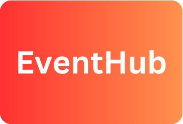

EventHub
==========



Event Hub is a **MERN Stack** full stack web application that aims to provide a platform for event sharing. The platform allows event organizers to post event information. Besides event organizers, the platform provides users with a convenient way to discover events and share their feedback.

# Features
### The platform will allow **users** to:
* Login and Logout
    * Users can login by clicking the login button.
        * Here users can login with an existing account or create a new account
        * A toast notification will pop up to inform users if they have logged in successfully or provide instructions if there is an issue.
    * While logged in, the login button will switch to a logout button dynamically. User can click it to log out of their current account.
* View Profile
    * After logging in, users can click on the profile button that direct them to their profile page.
    * On the profile page, users can change their usernames and upload a new profile image.
    * The profile page will display the user's username, a unique account ID, number of followings, and liked posts.
* Discover posts
    * Posts are dynamically displayed on the main/discover page in an event card format, which includes the publisher's username, event content(image or video), event title, and number of likes.
    * Users can click on the event cards that direct to the post page to view the event description and comments.
    * After clicking an event card, users can post comments to this post if user has logged in.
        * If the user is not logged in, this post page displays a button that direct users to the login window.
    * Users can like an event on both the main/discover page and the post page.
    * On post page, user can click on a comment to view the commenter's profile.
* Search for posts
    * Users can search posts based on the post's title, the publisher's username, and an event tag.
        * On the main/discover page, only posts that match the search criteria will be displayed.

### The Platform will allow **event organizers** to:
* Do everything that **users** can do, along with additional features
* Login and Logout
    * Event organizers must select "create an event organizer account" while creating a new account.
* Profile page
    * Instead of displaying number of followings, it will display number of followers.
    * Instead of displaying liked posts, it will display posts that created by the event organizer.
* Create a post
    * Event organizers can create a post by clicking the "Post" button.
        * They can add an image or video, event title, description, and tags.
        * After clicking the post button, the post will be displayed on the main/discover page

# Technologies
* Javascript
* Node.js
* React.js
* Express.js
* MongoDB

# Setup:
To run a local instance of EventHub, first clone or download a copy of this repository and follow the instructions below to initialize this application

### If you are not in the EventHub root directory
```bash
cd EventHub
```
Make sure you are at the root directory

### Install backend dependencies
```bash
npm install
```
which should download a set of `node_modules` for the backend server.
Main backend dependencies:
* Express.js - the web server library
* Mongoose - and object-document mapping library for MongoDB
* dotenv - manage environment variables

### Install frontend dependencies
```bash
cd frontend
npm install
cd ..
```
which should also download a set of `node_modules` for the frontend
Main frontend dependencies:
* React.js - library for web applications
* react-router-dom - simulates paths for different pages
* Vite.js - the build tool for web applications
* zustand - state management library

### Set up environment variables
```bash
cp .env.example .env
```
which should create a .env file that contain mongoDB's connection string and a PORT for your local host.
The Default PORT is 4000. if it is unavaliable, you can go to the .env file and replace 4000 with another port.

### To start the application
```bash
npm run dev
```
After starting the application successfully, in the terminal, Ctrl + click on the "Local: " link

# Authors
**EventHub** was made as a project for CS 35L taught by Professor Paul Eggert at UCLA in Winter 2025.
Made by: Jason Lin, Jinying Lin, Yinan Qiu, Dibin Wu, & Zhengwen Tang
